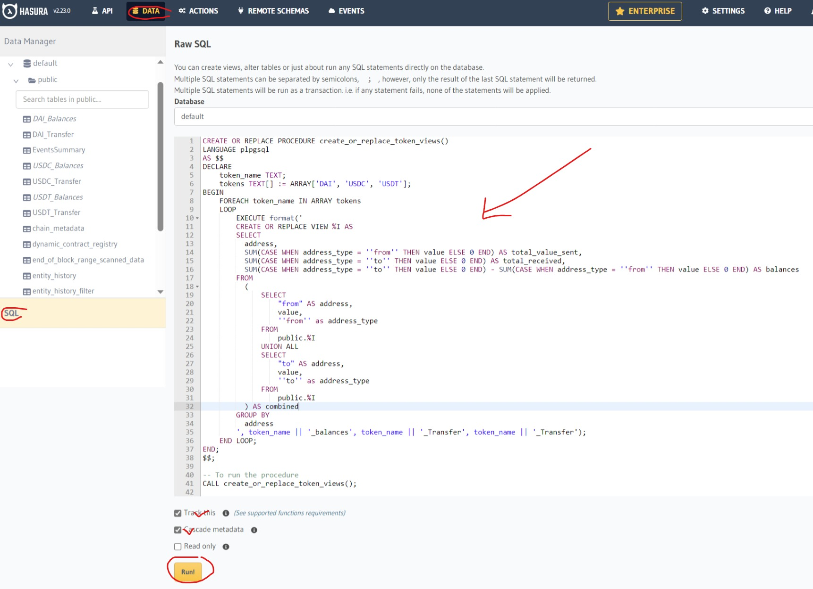

### Introduction

This is an indexer for Transfer events on the Ethereum blockchain. It indexes all Transfer events from the seleted ERC20 token. It is built using the Envio Indexer SDK.

### Configuration

The configuration file is located at `config/default.json`. The configuration file contains the following fields:

### Naming conventions

- Token Symbol: The symbol of the ERC20 token to index (e.g. DAI, USDC, etc) is denoted in capital letters.
- Table Names: The table names are in mixed case letters with the token symbol in capital letters and the type of event in proper case separated by underscores (e.g. `USDC_Transfer`, `USDC_Balances`, etc).

### Requirements

- Linux, MacOs, or Windows Linux subsystem
- Docker
- Node.js
- Envio Cli

### Installation

To install dependencies node run

```shell
npm install
```

### Running the app

- To run in develop mode

```shell
npm run dev
```

- To run Build

```shell
npm run build
```

### Views

Views are created in the database to make it easier to query the data. The views are created using the `create-view.pgsql` file to group receipts and transfers, to determine token balances for all addresses. The views are created in the envio database.

- To create a view run the query in `create-view.pgsql` on the envio database

Make sure to adjust the values in tokens array in create-view.pgsql to match the tokens that are being indexed. token symbols should be in capital letters

```sql
tokens TEXT[] := ARRAY['DAI', 'USDC', 'USDT'];
```

- You can run the query in the husara console or use another tool.


